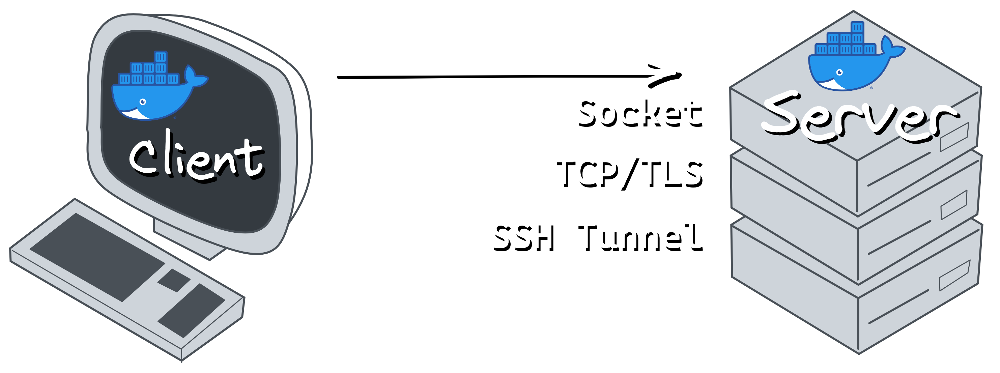

# Play with Docker

> Nav: [Back to Intro Lectures](../README.md)

A quick way to start a container before we get into the details.

You'll want Docker installed on your local machine, but before we get into all the configuration details, let's just run a simple container. Docker runs a web-based playground where you can learn the Docker command-line to get started.  It's called Play With Docker, or PWD for short.

You'll first need a Docker account to access PWD (this is really just a way to prevent abuse of this free service.)

Go to  [hub.docker.com](https://hub.docker.com/) and sign up for a free account.

Once you have that username and password, we can log into PWD and start a container.

## Start an instance of Play With Docker

Go to: [labs.play-with-docker.com](https://labs.play-with-docker.com/) and log in.

> Note: Sometimes PWD can be busy. If you get an error after login, you might try refreshing the browser or retrying in a few minutes. If PWD continues to have issues, you can just read through this lecture as we'll cover all these commands again on your local machine once you've installed Docker.

Once you're in a new session (with the countdown timer at the top), click `Add New Instance` to create a new shell that has access to the Docker CLI and Docker Engine (daemon).


You should now see a shell that has access to some basic Linux commands, as well as the Docker CLI.

Let's check our versions with the command:

`> docker version`

```text
> docker version

Client: Docker Engine - Community
 Version:           20.10.0
 API version:       1.41
 Go version:        go1.13.15
 Git commit:        7287ab3
 Built:             Tue Dec  8 18:54:00 2020
 OS/Arch:           linux/amd64
 Context:           default
 Experimental:      true

Server: Docker Engine - Community
 Engine:
  Version:          20.10.0
  API version:      1.41 (minimum version 1.12)
  Go version:       go1.13.15
  Git commit:       eeddea2
  Built:            Tue Dec  8 18:58:04 2020
  OS/Arch:          linux/amd64
  Experimental:     true
 containerd:
  Version:          v1.4.3
  GitCommit:        269548fa27e0089a8b8278fc4fc781d7f65a939b
 runc:
  Version:          1.0.0-rc92
  GitCommit:        ff819c7e9184c13b7c2607fe6c30ae19403a7aff
 docker-init:
  Version:          0.19.0
  GitCommit:        de40ad0
```

We'll get back two sets of versions, one for the "Client", which is the command-line binary we just ran, and one for the "Server", which is the Docker Engine background daemon that our Client talks to over the Docker API. In this case, the Docker Engine is running on the same machine as our Client, but it could also be running on a different machine, and we talk to it over Sockets, TCP, or SSH.



## Run an image from Docker Hub

Let's run a [Apache Web Server](https://hub.docker.com/_/httpd) container.

> Note: The image is called `httpd` rather than `apache` because the Apache web server's binary is named `httpd`.

```text
> docker run -d -p 8800:80 httpd

Unable to find image 'httpd:latest' locally
latest: Pulling from library/httpd
ae13dd578326: Pull complete
fd997b74d81b: Pull complete
248a67212d22: Pull complete
60cf240b9129: Pull complete
b75bd115573c: Pull complete
Digest: sha256:94cd479f4875e3e0fba620baf7a0e9353e15783368f4f74b9ea5bdc729b3f366
Status: Downloaded newer image for httpd:latest
049c7a9c9f5606db8cdd51f572a6493116f445d721c64324887508041f4d8d14
```

We now have the latest version of an Apache Web Server running in a container!

But wait, so much happened in the background that you might have missed it, so let's go step-by-step:

1. The Docker Client tells our Docker Engine to:
   1. `run` the `httpd` image in a new container.
   2. `-d` run it in the background (detached).
   3. `-p 8800:80` Open port 8800 on our host IP and forward traffic into the containers port 80.
2. Docker Engine didn't see us specify a version of Apache, so it assumes `latest`, similar to how other package managers default to the latest version.
3. Docker Engine can't find a cached image locally called `httpd:latest`, so it downloads it from Docker Hub first.
4. Docker Engine creates a new container from the `httpd:latest` image.
5. Docker Engine creates a new virtual ethernet interface on the host and connects it to the container. This `veth` is connected to Docker's default network, which is [NATed](https://en.wikipedia.org/wiki/Network_address_translation) behind the host NIC.
6. Docker Engine assigns a unique IP to the container, which is a private subnet that docker controls. By default it routes through the host IP to access the real network gateway and internet.
7. Docker Engine asks the host to open port 8800 on our host IP (and localhost) and forward that traffic into the container IP on port 80, which is where Apache listens by default.
8. Docker Engine starts the container process `httpd`.
9. Docker Engine returns a unique container ID to the client.

Wow that's a lot of steps! Imagine doing all that by hand before Docker. 🤣

We can check if the Apache server is working by using `curl` on the *published* port 8800

```text
> curl localhost:8800

<html><body><h1>It works!</h1></body></html>
```

Let's list the running containers with `docker ps`

```text
> docker ps

CONTAINER ID   IMAGE     COMMAND              CREATED          STATUS          PORTS                  NAMES
049c7a9c9f56   httpd     "httpd-foreground"   24 minutes ago   Up 24 minutes   0.0.0.0:8800->80/tcp   upbeat_mclean
```

Now, because that container is fully isolated, we can run many copies of Apache on the same machine and they won't interfere with each other.

> Note: Remember that just like any process that listens on a IP port, that two processes can never listen on the same IP:PORT combination at the same time, so we do have to change the *published* port so that our host doesn't give us an error of "port already in use".

## Run a second container from the same image

Let's run a second Apache container that's listening on port 8801.

```text
> docker run -d -p 8801:80 httpd

daf459a2c121b4d6007f9779d0563368564a4c50632e888afc0de59c192db065
```

This time, Docker knew we already had the image cached, so it did all the startup steps as before, except using the existing cached image.

We should now see two containers running:

```text
> docker ps

CONTAINER ID   IMAGE     COMMAND              CREATED              STATUS              PORTS                  NAMES
daf459a2c121   httpd     "httpd-foreground"   About a minute ago   Up About a minute   0.0.0.0:8801->80/tcp   nervous_hopper
049c7a9c9f56   httpd     "httpd-foreground"   31 minutes ago       Up 31 minutes       0.0.0.0:8800->80/tcp   upbeat_mclean
```

> Note: docker has many CLI aliases to keep it backwards compatible and friendly. You could also type `docker container ls` to get the same result.

These two Apache containers share nothing in common except the image and the host IP they are "published" to. The two containers can have their own Apache running on port 80 at the same time, because each container gets a virtual ethernet interface, or `veth`. The `-p` tells the Linux host's `iptables` to route the traffic from `host-ip:8800` and `host-ip:8801` to the respective container's `container-ip:80`.


From here we can run many more containers, we can use `docker logs <id>` to see the output of each container, and we can use `docker exec <id>` to run additional commands inside the container.

We can even run different versions of the same application by adding a version, so you could do the same thing with `httpd:2.4.52` and it'll download that image as well.

This command also operates the same on any system you run it from, including different OSs (Linux, macOS, Windows) and platforms (x86_64, arm64, i386, etc.)

You'll learn a lot more commands and features throughout this course, but hopefully you're already seeing some of the benefits of running software this way.

> Nav: [Back to Intro Lectures](../README.md)

## Further reading

- [Docker Official Images](https://docs.docker.com/docker-hub/official_images/)
- [Apache Web Server Official Docker Image](https://hub.docker.com/_/httpd)
