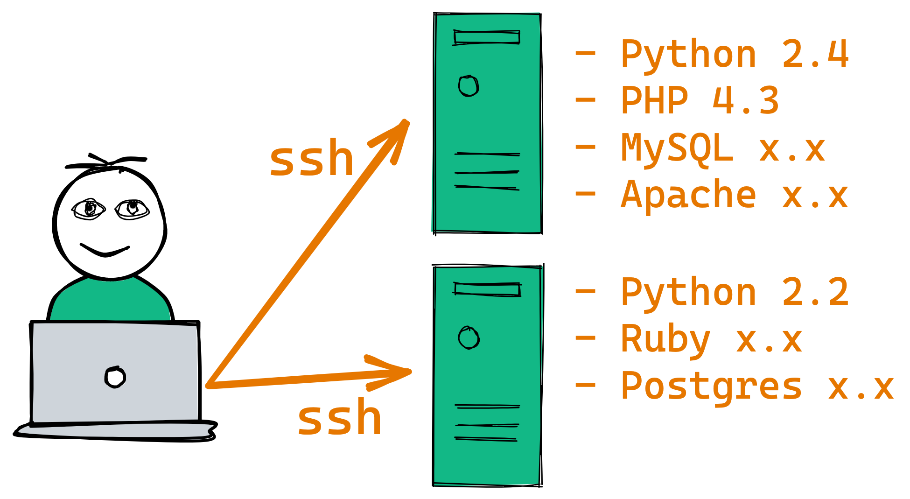
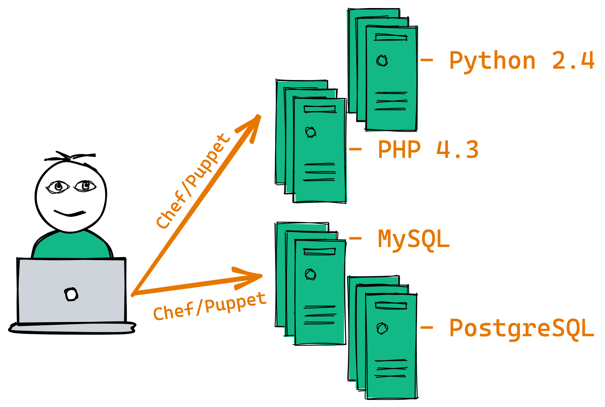
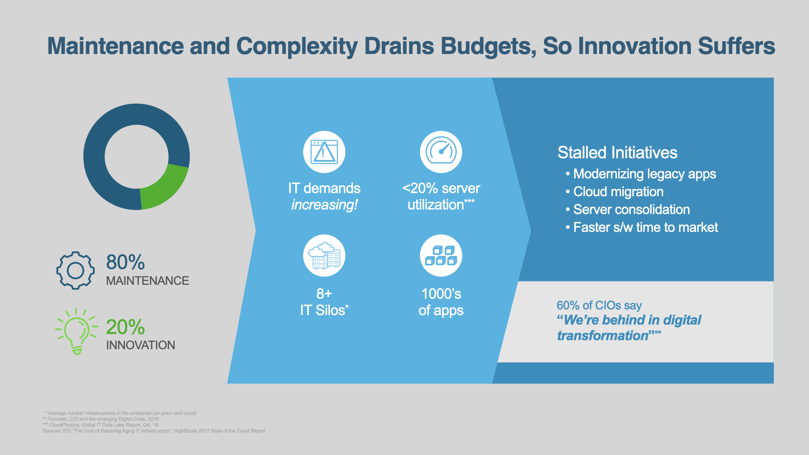
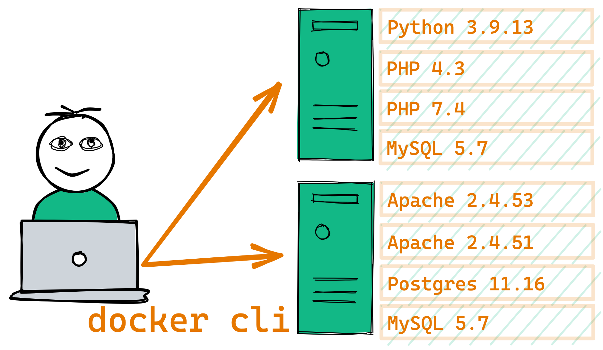
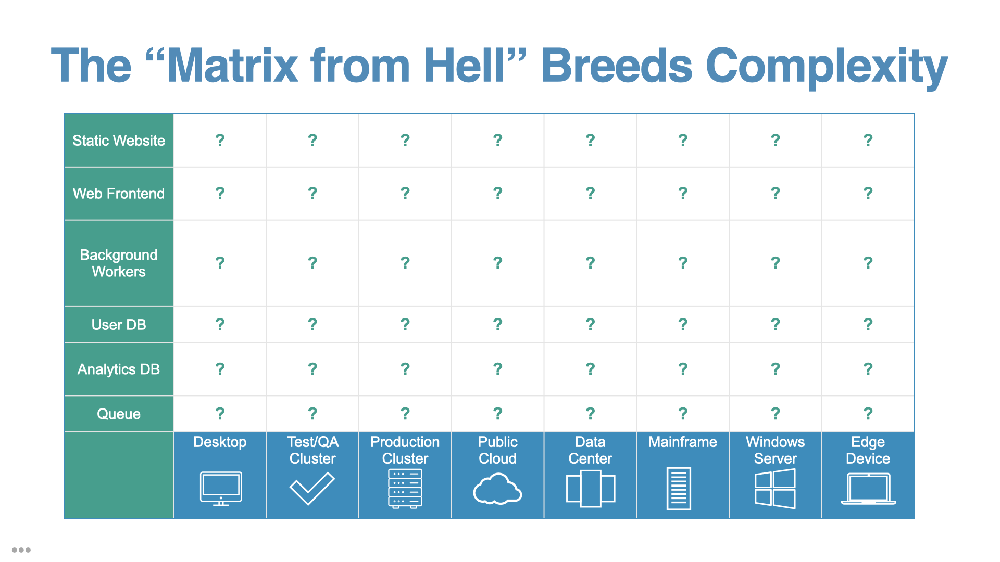
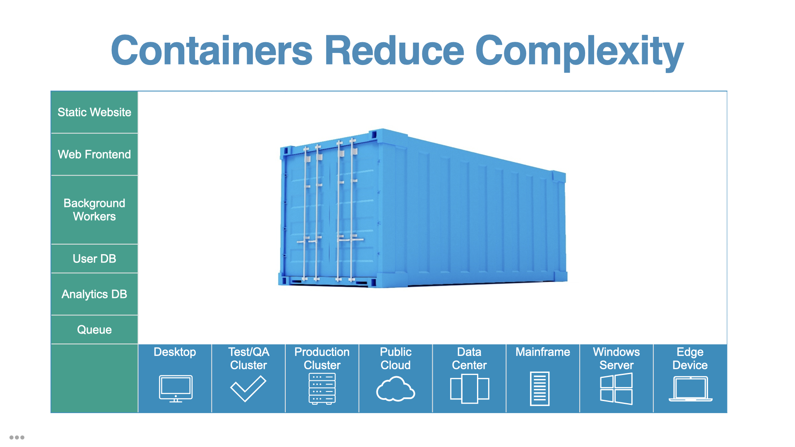
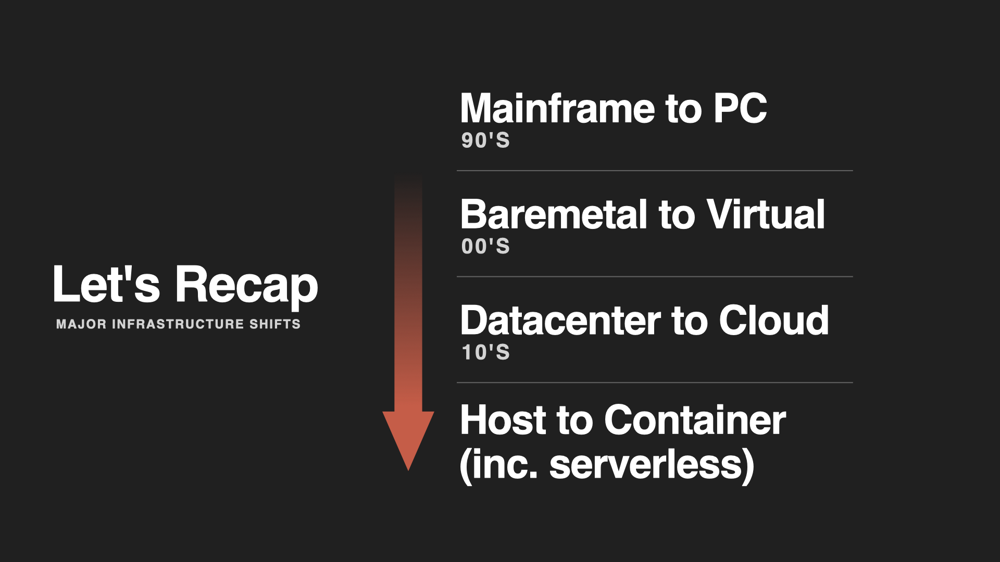

# Why does Docker exist?

> Nav: [Back to Intro Lectures](../README.md)

Now that you know the basics of what Docker is, you might be thinking that this sounds like a lot of work to re-package software so that we can run it a different way. Obviously we all were building, distributing, and running software before Docker came along, so "Why Docker, and Why Now?".

Docker *needed* to exist because the old ways were full of friction and complexity when met with the modern area of software development and the speed at which we needed to operate. I've broken this down into three main reasons Docker (and modern containers) needed to exist.

- The Problem of Isolation
- The Problem of Environments
- The Problem of Speed

## The problem of isolation

Long ago (decades) it was common for sysadmins to just need a few bare metal servers, and combine a bunch of unrelated software services on each. Physical servers were expensive, with long lead times to obtain more. Any one server may run several or dozens of unrelated business-related processes in order to 1. reduce the number of systems each sysadmin needed to manage and 2. get better utilization out of each expensive server.

The problem was each of these systems was quite complex, and we had to strike a delicate balance between getting good use of these expensive servers and avoiding one app from affecting (or breaking) another. Isolation features weren't mature, so we were often afraid to touch one app on a system, in fear of breaking another. Luckily, software releases were far and few between, usually on floppy or CD, so these events, while rare, required significant planning and effort.

Over the years (2000s) the pace of software updates started to quicken, and the internet fed this fire. Updates were coming quarterly rather than yearly. Virtual machines (VMs) became a reality and in just a few years the number of systems each of us were managing exploded. We could no longer handle one-at-a-time systems management. We had to create a whole new set of tools to manage them all, including Puppet and Chef.

Once we got a handle on our sprawling VM count, we **started to operationalize around the "one app, one VM" model**. You might install the PHP app on one VM, and the Python app on another one. They got their own resources and lifecycle. The motivation here was multi-faceted: Using the OS as the isolation boundary meant we could corelate the cost, downtime, creation/destruction, and management of each VM around the app (and customers) it was designed to serve. OSs were sized for the few (or one) app they were designed to run.

Overall this was a win for the business, with only a handful of operators able to manage hundreds or thousands of VMs through automation and new tooling.

But this came at a cost. First, we were now in OS management hell, with tons of unnecessary cost and waste from running heavy weight OSs and their automation tools (every VM OS had monitoring agents, logging agents, antivirus scanning, backup agents, etc.)  Second, our overall utilization of hardware resources was still averaging only 10% (similar to the percent when we were back in the bare metal OS days.) Third, it was still a significant effort to deploy and update apps on those VMs. Software updates were quickening, with many of us implementing a monthly software update cycle. Some teams still updated apps on existing servers, and some started using OS images as the deployable artifact. They would deploy new VM instances for every software release, and destroy the old ones!

But OSs were never designed for this. They were heavy, complex, and not designed for quick setup and booting.

By the 2010s, many, if not most IT organizations were starting to drown in maintenance. For every new VM, OS, and custom app configuration they had to support, there was less time left for innovation and new projects.

Large tech companies like Netflix and Google saw these patterns of waist and started using Linux, BSD, and Solaris features in the 2000s to create early-day isolation between apps on the same system. That way they didn't need to spin up a new VM for a new app, they could just isolate it on an existing system without fear of affecting other apps. They also starting creating custom OS builds that were purpose-fit for only managing these isolation's, rather than being a full-featured OS with hundreds of tools pre-installed.

They started realizing the benefits of this design, including:

- Improved time-to-deploy
- Improve Time-to-scale
- Overall lower VM and OS count
- Improved app isolation
- Higher hardware utilization

> This is it. Containers are the next once-in-a-decade shift in infrastructure and process that can make or break your success. --Bret Fisher 😎

Docker made it easy for all of us to adopt these new ideas of what a "container" could be. It allows us to still isolate our apps, but without all the unnecessary VM sprawl. Our new design looks much like the original 90's pre-VM design, but with the benefit of app isolation:

## The problem of environments

Have you ever heard of the [Works on My Machine](https://blog.codinghorror.com/the-works-on-my-machine-certification-program/) (WOMM) problem?

(WOMM Badge Copyright: [Jeff Atwood](https://codinghorror.com/))

"Works on My Machine" is a satirical name for "I've *only* tested on my machine".

The idea of WOMM (while snarky) is that you shouldn't just write or test software that only works on your machine. We need to design software that works on other machines. Today, that means it needs to work across all the developers, operators, and testers machines. Then it also needs to work the same in automated testing environments, and multiple server environments.

The problem of environments in our increasingly de-centralized and distributed world is that we can't predict the exact environment our software will run on or what resources it will have.

> However many environments you're managing today (N), tomorrow it'll be N+1. --Bret Fisher 😎

Combine that with the proliferation of software languages, dependency managers, frameworks, and any single multi-app solution is likely the combination of multiple languages, dependency installers, and configuration types.  The web frontend might be React (JavaScript), the backend written in PHP, while a job processor is written in Python. Then you may need Postgres, Redis, RabbitMQ, and Elasticsearch to run along with them.

Docker's founder Solomon Hykes called this the "Matrix from Hell", and it's more common then ever.

**One of the design goals of Docker images and containers was to create a new level of abstraction**, a contract between the developers build instructions for the app (the Dockerfile) and the environment it runs in (the container runtime, in this case Docker Engine.)

Ideally, if you've containerized an app, the matrix looks like this:

We've reduced the N+1 number of environments for how to build and run our software to 1.

## The problem of speed

Every major shift in computing has been motivated by speed. Not necessarily the speed of CPUs or networks directly, but the speed of delivering ideas into software, and software to users.

From the mainframes of the 70s to the PCs of the 90s. From the virtualization of the 00s to the cloud of the 10s. It was motivated by getting human ideas into code, and into the customers hands as fast as possible, then repeat.

By combining the ideas of the image, registry, and container, Docker (and the tooling it inspired) improves the time-to-complete in nearly every part of the software lifecycle:

- Develop faster
- Build faster
- Test faster
- Deploy faster
- Update faster
- Recover faster

Docker also did something that often didn't happen with these previous decade-long shifts in computing: They designed it to be used with *existing* apps, often avoiding any changes to source code. **This greatly accelerated the adoption of containers**, often with enterprises migrating hundreds of existing applications to Docker in just a few years.

In the early days of enterprise adoption, we were seeing data (coming out of Docker Inc.) showing the kind of incredible benefits that you only see once every decade in the software world. Large complex multi-national companies were reporting before/after benefits of containerization such as:

- 70% reduction in VM costs
- 50% developer productivity boost
- 10x average CPU utilization, improving usage of existing resources
- 90% reduction in maintenance costs
- 50% increase in speed of build-test-deploy cycles

Even with the added complexity of "Dockerizing" existing apps, re-tooling systems, and training engineering teams in Docker, these numbers are still impressive.

## Why Docker, why now?

Hopefully my three points started to convince you that Docker is the right tool for the job, at the right time in the evolution of IT and creating software. If you're still not convinced, you can read more about Docker in the [Docker Documentation](https://docs.docker.com/engine/userguide/).

## Further reading

- [A Brief History of Containers: From the 1970s till now (aquasec.com)](https://blog.aquasec.com/a-brief-history-of-containers-from-1970s-chroot-to-docker-2016)
- [Docker Engine Documentation](https://docs.docker.com/engine/userguide/)
